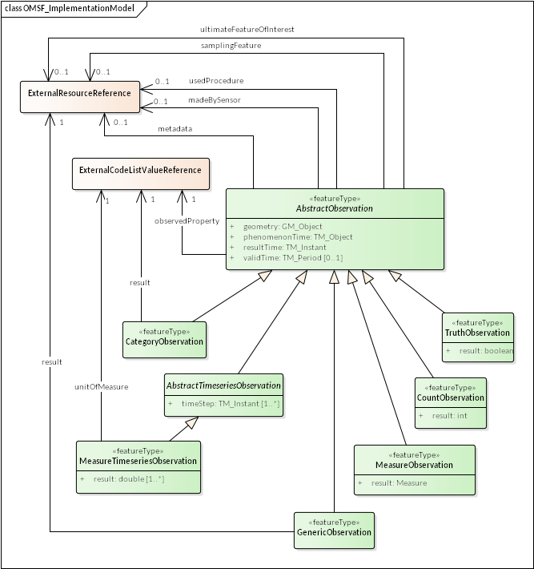

# OGC Observations and Measurements - Simple Feature Encodings (OMSF)

---

**NOTE**: These encodings are work-in-progress, and at this point, has not been endorsed by the OGC or any other standards organization. They may (and probably will) change in a backwards incompatible way during the drafting process.

There is an on-going discussion in leveraging the OMSF encodings
in the INSPIRE alternative encodings action ([MIWP 2017.2](https://ies-svn.jrc.ec.europa.eu/projects/2017-2/wiki)) for a simplified encoding of the INSPIRE O&M datasets.

The namespaces http://www.opengis.net/omsf-gml/1.0 and http://www.opengis.net/omsf-json/1.0 have not (yet)
been approved by the OGC Naming Authority, and thus may also change. Consider yourself warned.

---

Handling complex feature structure of the O&M XML Implementation
(as in OGC 10-025r1) typically creates a considerable additional implementation cost, added code complexity and lower
performance for both server and client software. The purpose of this activity is to define simple encodings for the most used O&M Observation types, and thus
enable interoperable O&M data exchange between existing software applications, servers and clients limited to using simple (non-complex)
GML features and/or GeoJSON.

## OMSF Implementation model



All OMSF encodings are based on the same implementation model profile derived from the O&M Observation Core and Specialized
Observations conceptual models defined in Observations and Measurements v2.0
([OGC Document 10-004r3](http://portal.opengeospatial.org/files/?artifact_id=41579), also published as ISO 19156:2011,
Geographic information — Observations and Measurements). Although the implementation model is encoding-independent, the
feature structure and property types have been intentionally chosen to be easily encodable as simple features according
to the requirements of the GML Simple Features Profile version 2.0 ([OGC Document 10-100r3](http://portal.opengeospatial.org/files/?artifact_id=42729).

The OMSF contains implementation model classes for the following O&M Core and Specialized Observation UML classes:

O&M v2.0 class | OGC name | OMSF feature|
---------------|----------|-------------------|
OM\_CategoryObservation | http://www.opengis.net/def/observationType/OGC-OM/2.0/OM_CategoryObservation | omsf:CategoryObservation
OM\_CountObservation | http://www.opengis.net/def/observationType/OGC-OM/2.0/OM_CountObservation | omsf:CountObservation
OM\_Measurement | http://www.opengis.net/def/observationType/OGC-OM/2.0/OM_Measurement | omsf:MeasureObservation
OM\_Observation | http://www.opengis.net/def/observationType/OGC-OM/2.0/OM_Observation | omsf:GenericObservation
OM\_TimeSeriesObservation | http://www.opengis.net/def/observationType/OGC-OM/2.0/OM_TimeSeriesObservation | omsf:MeasureTimeseriesObservation
OM\_TruthObservation | http://www.opengis.net/def/observationType/OGC-OM/2.0/OM_TruthObservation | omsf:TruthObservation
OM\_ComplexObservation | http://www.opengis.net/def/observationType/OGC-OM/2.0/OM_ComplexObservation | not implemented
OM\_DiscreteCoverageObservation | http://www.opengis.net/def/observationType/OGC-OM/2.0/OM_DiscreteCoverageObservation | not implemented
OM\_GeometryObservation | http://www.opengis.net/def/observationType/OGC-OM/2.0/OM_GeometryObservation | not implemented
OM\_PointCoverageObservation | http://www.opengis.net/def/observationType/OGC-OM/2.0/OM_PointCoverageObservation | not implemented
OM\_TemporalObservation | http://www.opengis.net/def/observationType/OGC-OM/2.0/OM_TemporalObservation | not implemented

The implementation model is intentionally more limited than the one used for the
Observations and Measurements - XML Implementation ([OGC Document 10-025r1](http://portal.opengeospatial.org/files/?artifact_id=41510))
and OGC Observations and Measurements – JSON implementation ([OGC Document 15-100r1](https://portal.opengeospatial.org/files/64910))
which are able to express the full O&M abstract model. However, expressing any type of O&M Observation is possible by
using the ```omsf:GenericObservation``` feature type with a remote reference to the Observation result.

This simplified implementation models for the sampling feature and the ultimate feature of interest is realised
by embedding their essential properties into the Observation class itself.
The sampling feature is encoded by one mandatory property ```geometry``` and an optional property  ```samplingFeature```.
In a similar fashion the ultimate feature of interest (the model of the observed real-world object)
is encoded using an optional property: ```ultimateFeatureOfInterest```. The ```geometry``` property of a
OMSF Observation feature is the geometry of the sampling feature of the observation, or if no sampling
feature was used, a representative geometry of the ultimate feature of interest.


### Property mapping
The implementation model of the OMSF is a simplified version of the Observation class
as defined in the ISO 19156 standard. The following table summarises the simplification decisions applied:

O&M attribute/association | O&M type | O&M Multiplicity  |OMSF property | OMSF type |
--------------------------|----------|-------------------|--------------|-----------|
featureOfInterest | association with GFI_Feature | 1 | geometry | GM_Object |
featureOfInterest | association with GFI_Feature | 1 | samplingFeature | Reference to an external resource |
featureOfInterest | association with GFI_Feature | 1 | ultimateFeatureOfInterest | Reference to an external resource |
metadata | association with MD_Metadata | 0..1 | metadata | Reference to an external resource |
observedProperty | association with GF_PropertyType | 1 | observedProperty | Reference to an external code list |
parameter | NamedValue | 0..n | n/a | n/a |
phenomenonTime | TM_Object | 1  | phenomenonTime | TM_Object |
procedure | association with OM_Process | 1 | usedProcedure | Reference to an external resource |
procedure | association with OM_Process | 1 | madeBySensor | Reference to an external resource |
relatedObservation | association with self | 0..n |  n/a | n/a |
result | Any | 1 | result | varied |
result | Any | 1 | timeStep | TM_Instant |
result | Any | 1 | unitOfMeasure | Reference to an external code list |
resultQuality | DQ_Element | 0..n | n/a | n/a |
resultTime | TM_Instant | 1 | resultTime | TM_Instant |
validTime | TM_Period | 0..1 | validTime | TM_Period |

Rationale for the not included (n/a) properties:

* **parameter**: 0..n multiplicity of name-value pairs (as user defined types) would require compliance level SF-1, or a specially encoded list type. Trade-off between completeness and simplicity.
* **relatedObservation**: not a problem to include technically (as a reference), but rarely used in practice.
* **resultQuality**: embedded quality info would a user-defined type and thus SF-1 level. Rarely used in practice,  trade-off between completeness and simplicity.

### Design considerations

The following primary design goals have been followed (in priority order):

1. The defined feature types must be suitable for encoding using GML Simple Features Profile level SF-0 or SF-1.
1. Each defined feature type must have a relevant geometry property for spatial processing and map visualization purposes.
1. The defined feature types must follow the O&M model structure and property naming as long as it does not conflict with higher priority design goals.
1. The defined GML feature types should be as simple as possible, but not simpler (so called Einstein's razor).

Feature of interest of the described Observation is represented as separate parts for the *sampling feature* and the *ultimate feature of interest* as suggested by [W3C Extensions to the Semantic Sensor Network Ontology proposal](https://w3c.github.io/sdw/proposals/ssn-extensions/). Also to align with the [W3C Semantic Sensor Network Ontology specification](https://www.w3.org/TR/vocab-ssn/), the method and the implementation of the measurement procedure has been split into two separate properties: ```usedProcedure``` and ```madeBySensor```.

In contrast to the OMXML (complex feature) implementation model, hard-typing is used for the different Observation types: ```GenericObservation```, ```MeasureObservation```, ```CategoryObservation```, ```CountObservation```, ```TruthObservation``` and ```MeasureTimeseriesObservation``` are each defined as separate feature types with fixed result value types. This is an intentional trade-off between simplicity and flexibility: Hard typing allows
for easier, more precise definition of the Observation content model, especially the observation result, in the APIs providing
OMSF data. On the other hand, the providing Observation data for novel result content type requires changes to the OMSF
model.

Observations with complicated results, such as coverages, are in most cases out-of-scope of the OMSF context.
However, it's possible to encode these using the ```GenericObservation``` feature type with a reference to any
remotely provided result. The observation level metadata and the definition of the observed property are
always externally linked from the OMSF Observations.

### Timeseries data

OMSF implementation model contains MeasureTimeseriesObservation feature type for encoding simple,
double-valued time series data.
Time series with result values for several points in time does not fit with the GML Simple Features Profile
compliance level SF-0 without mild violence, since repeated elements are not allowed. Technically the time series
values (and even time instances) could be encoded inside a single element using list type, but encoding and
decoding would require special processing, which would at least partly defeat the gains of restricting the feature type to SF-0.
So the MeasureTimeseriesObservation contant repeated ```timeStep``` and ```result``` properties which require using
SF-1 compliance level when encoding into GML Simple Features.

GML encoding example:
```xml
<omsf:MeasureTimeseriesObservation gml:id="f-1">
  <omsf:phenomenonTimeStart>2017-08-17T12:00:00Z</omsf:phenomenonTimeStart>
  <omsf:phenomenonTimeEnd>2017-08-17T18:00:00Z</omsf:phenomenonTimeEnd>
  <omsf:resultTime>2017-08-17T12:11:20Z</omsf:resultTime>
  <omsf:usedProcedure xlink:href="http://xml.fmi.fi/process/met-surface-observations" xlink:title="Meteorological surface observations" />
  <omsf:observedProperty xlink:href="http://vocab.nerc.ac.uk/collection/P07/current/CFSN0023/" xlink:title="air_temperature" />
  <omsf:samplingFeatureName>Helsinki Kumpula weather observation station</omsf:samplingFeatureName>
  <omsf:geometry>
      <gml:Point gml:id="p-1" srsName="http://www.opengis.net/def/crs/EPSG/0/4258" srsDimension="2">
          <gml:pos>60.20307 24.96131</gml:pos>
      </gml:Point>
  </omsf:geometry>
  <omsf:ultimateFeatureOfInterestName>Helsinki Kumpula</omsf:ultimateFeatureOfInterestName>
  <omsf:ultimateFeatureOfInterestReference xlink:href="http://sws.geonames.org/843429/about.rdf"/>
  <omsf:timeStep>2017-08-17T12:00:00Z</omsf:timeStep>
  <omsf:timeStep>2017-08-17T13:00:00Z</omsf:timeStep>
  <omsf:timeStep>2017-08-17T14:00:00Z</omsf:timeStep>
  <omsf:timeStep>2017-08-17T15:00:00Z</omsf:timeStep>
  <omsf:timeStep>2017-08-17T16:00:00Z</omsf:timeStep>
  <omsf:timeStep>2017-08-17T17:00:00Z</omsf:timeStep>
  <omsf:timeStep>2017-08-17T18:00:00Z</omsf:timeStep>
  <omsf:unitOfMeasure xlink:href="www.opengis.net/def/uom/UCUM/degC" xlink:title="Degree Celsius"/>
  <omsf:result>12.5</omsf:result>
  <omsf:result>12.0</omsf:result>
  <omsf:result>11.0</omsf:result>
  <omsf:result>13.2</omsf:result>
  <omsf:result>12.5</omsf:result>
  <omsf:result>14.1</omsf:result>
  <omsf:result>14.1</omsf:result>
</omsf:MeasureTimeseriesObservation>
```

JSON encoding example:
```json
{
  "type": "Feature",
  "id": "f-1",
  "geometry": {
    "type": "Point",
    "coordinates": [ 24.96131, 60.20307 ]
  },
  "properties": {
    "observationType": "MeasureTimeseriesObservation",
    "phenomenonTimeStart": "2017-08-17T12:00:00Z",
    "phenomenonTimeEnd": "2017-08-17T18:00:00Z",
    "resultTime": "2017-08-17T12:11:20Z",
    "usedProcedureName": "Meteorological surface observations",
    "usedProcedureReference": "http://xml.fmi.fi/process/met-surface-observations",
    "observedPropertyName": "air_temperature",
    "observedPropertyReference": "http://vocab.nerc.ac.uk/collection/P07/current/CFSN0023/",
    "samplingFeatureName": "Helsinki Kumpula weather observation station",
    "ultimateFeatureOfInterestName": "Helsinki Kumpula",
    "ultimateFeatureOfInterestReference": "http://sws.geonames.org/843429/about.rdf",
    "timeStep": [
        "2017-08-17T12:00:00Z",
        "2017-08-17T13:00:00Z",
        "2017-08-17T14:00:00Z",
        "2017-08-17T15:00:00Z",
        "2017-08-17T16:00:00Z",
        "2017-08-17T17:00:00Z",
        "2017-08-17T18:00:00Z"
    ],
    "unitOfMeasureName": "Degree Celsius",
    "unitOfMeasureReference": "http://www.opengis.net/def/uom/UCUM/degC",
    "result": [12.5, 12.0, 11.0, 13.2, 13.5, 14.1, 14.1]
  }
}
```

The using repeated properties allows client applications to treat both ```timeStep``` and ```result``` as arrays of
simple values, which would not be possible using time-value-pair encoding.

## GML and GeoJSON Encodings

OMSF contains both GML and GeoJSON encodings of the common OMSF implementation model defined above. For more details see

* [GML Simple Features Profile 2.0 encoding](./omsf-gml), and
* [GeoJSON encoding](./omsf-json/).

## Acknowledgements

Work on this application profile was initiated by Ilkka Rinne for the needs of Vaisala and Finnish Meteorological Institute in 2017.
